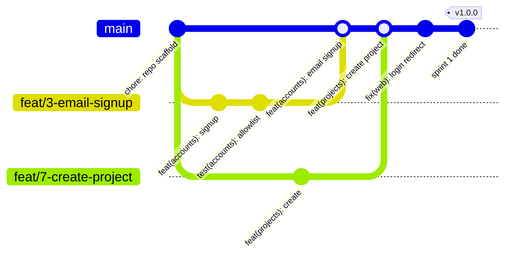

# CI/CD and Branching

## Branching: GitHub Flow + release tags

- `main` is protected: PR required, 1 approving review, CI green, linear history, squash merge only, no force push.
- One branch per issue, named by type:
  - `feat/<issue>-slug` e.g. `feat/14-swipe-deck`
  - `fix/<issue>-slug`, `chore/<issue>-slug`, `docs/<issue>-slug`
- Commits follow Conventional Commits: `feat(matching): lock team when last role filled`. Scopes are app or feature names (`accounts`, `profiles`, `projects`, `matching`, `chat`, `web`, `infra`, `docs`).
- The squash commit title is the PR title, so the PR title must be a valid conventional commit.
- PR body uses the template: summary, `Closes #<issue>`, how it was tested, and a `Reviewer: @name` line (the course check-in notes need the reviewer).
- Keep PRs small (aim under 400 changed lines, not counting generated client).
- End of each sprint: tag `main` as `v<sprint>.<minor>.0` (e.g. `v1.0.0` after Sprint 1). The tag triggers the release.

### Example

Squash merges show up as a single commit on `main`.



## CI (`.github/workflows/ci.yml`)

Runs on every PR and on push to `main`. `concurrency` cancels older runs on the same branch. `permissions: contents: read`.

| Job | Steps | Fails when |
|---|---|---|
| `backend` | uv sync, `ruff check`, `ruff format --check`, `mypy`, `pytest` with Postgres 17 and Redis 7 service containers | lint, types or tests fail, coverage under threshold |
| `frontend` | pnpm install (frozen lockfile), `eslint`, `tsc --noEmit`, `vitest`, `next build` | lint, types, tests or build fail |
| `contract` | generate `backend/schema.yml`, regenerate `packages/api-client`, `git diff --exit-code` | schema or client not committed after an API change |
| `docker` | buildx build `backend/Dockerfile` and `frontend/Dockerfile`, no push, GHA cache | an image does not build |
| `gitleaks` | scan the diff for secrets | a secret is found |

Branch protection requires all five. `make check` runs the same checks locally.

Playwright e2e for the golden path runs on `main` and nightly (added in Sprint 3), not on every PR, to keep PR CI fast.

Dependabot opens weekly PRs for pip (uv), npm (pnpm) and GitHub Actions.

## Release (`.github/workflows/release.yml`)

On push of a tag matching `v*`:

1. Checkout, set up buildx, log in to GHCR with `GITHUB_TOKEN` (`permissions: packages: write`).
2. Build and push:
   - `ghcr.io/season101/teammatch-api`
   - `ghcr.io/season101/teammatch-web`
3. Tags from `docker/metadata-action`: `1.2.0`, `1.2`, `latest`, and `sha-<short>`.
4. Create a GitHub Release with auto-generated notes from the squash commits.

The repo is public, so the images are public and the host can pull without logging in.

## Manual deploy

Deploys follow the sitashma-infra convention and are done by hand after a release.

1. Wait for the release workflow to finish and check both images exist on GHCR.
2. In `sitashma-infra`, bump the submodule and set the version:
   ```bash
   cd apps/teammatch && git fetch --tags && git checkout v1.0.0 && cd ../..
   # set TEAMMATCH_VERSION=1.0.0 in apps/teammatch/deploy/.env
   git add apps/teammatch && git commit -m "Bump teammatch submodule to v1.0.0"
   git push
   ```
3. On the host:
   ```bash
   git pull && git submodule update --init apps/teammatch
   docker compose --profile apps pull teammatch-api teammatch-web
   docker compose --profile apps up -d
   docker compose ps
   ```
4. Verify:
   - `docker compose ps` shows `teammatch-*` healthy and `teammatch-migrate` exited 0.
   - `docker compose exec teammatch-api curl -fsS localhost:8000/readyz` returns 200.
   - `https://teammatch.sijancodes.com` loads, login works, `/api/v1/me/` returns 200 when logged in.
   - Chat page connects (WS 101 in browser devtools).
5. Rollback: set `TEAMMATCH_VERSION` to the previous tag and repeat step 3. Migrations must stay backward compatible for one release so this works.

## Pipeline

```mermaid
flowchart LR
    dev["Developer<br/>feat/issue-slug branch"]
    pr["Pull request<br/>template + Reviewer line"]

    subgraph ci ["CI workflow"]
        direction TB
        be["backend<br/>ruff, mypy, pytest"]
        fe["frontend<br/>eslint, tsc, vitest, build"]
        ct["contract<br/>schema + client drift"]
        dk["docker<br/>build both images"]
        gl["gitleaks"]
    end

    review["1 approving review"]
    main["main<br/>squash merge"]
    tag["tag v*<br/>end of sprint"]

    subgraph rel ["Release workflow"]
        direction TB
        build["buildx build"]
        ghcr["push to GHCR<br/>teammatch-api, teammatch-web"]
        notes["GitHub Release notes"]
    end

    subgraph deploy ["Manual deploy on sitashma-infra"]
        direction TB
        bump["bump submodule + TEAMMATCH_VERSION"]
        pull["compose pull"]
        up["compose up -d"]
        verify["verify readyz + smoke test"]
    end

    dev --> pr --> ci
    ci -->|"all green"| review --> main --> tag --> build --> ghcr --> notes
    ghcr --> bump --> pull --> up --> verify
```


