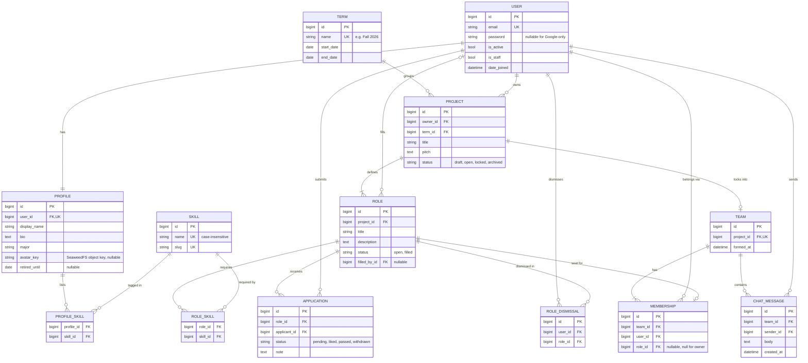
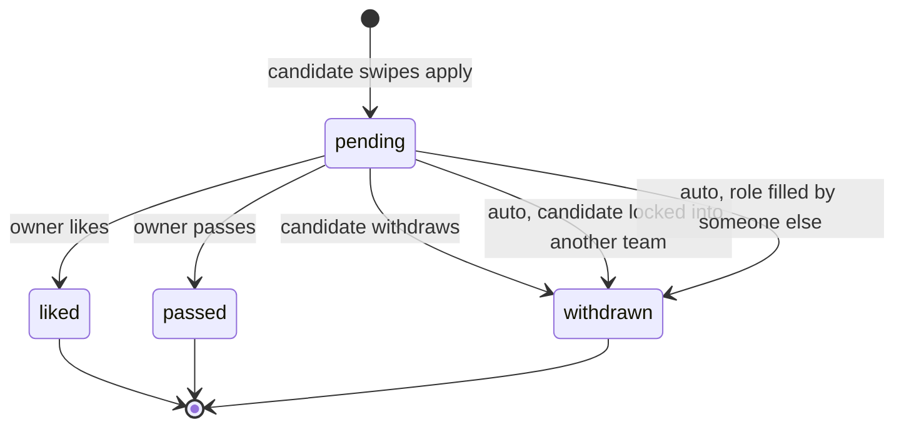
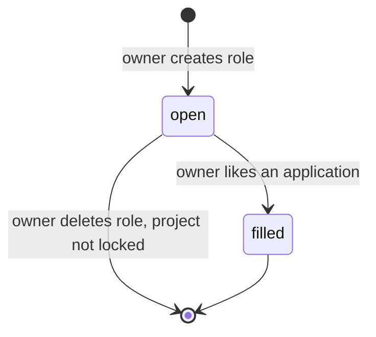
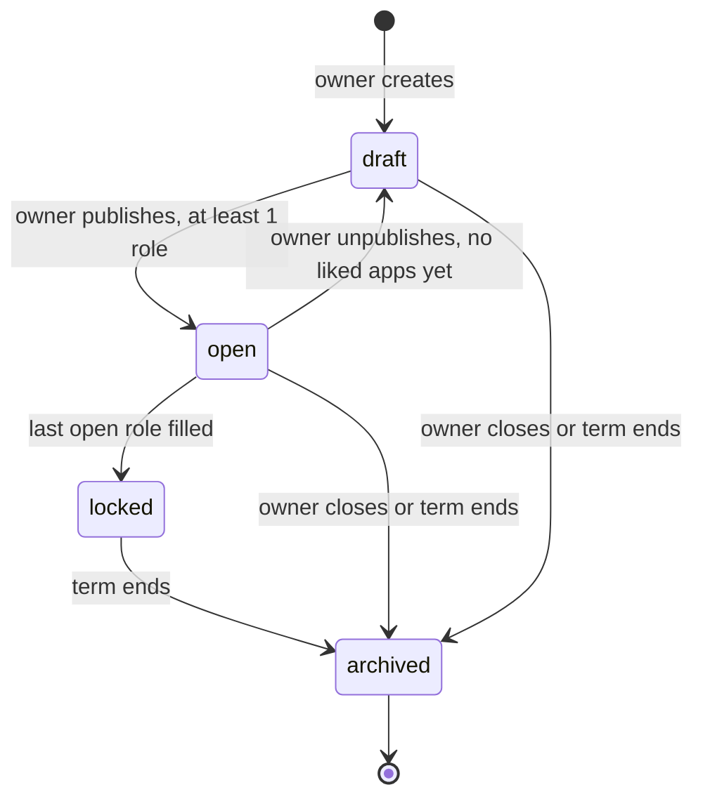

# Data Model

All tables live in one Postgres 17 database. Every table has an `id` bigint PK and `created_at` / `updated_at` unless noted. Enums are stored as short text with a `CHECK` constraint (Django `TextChoices`).

## ERD

Notes:

- `Profile_Skill` and `Role_Skill` are plain M2M through tables (`Profile.skills`, `Role.required_skills`).
- `Term.start` / `Term.end` are stored as `start_date` / `end_date` (`end` is a reserved word in SQL).
- `Membership.role` is null for the project owner, who is always a member.
- `ChatMessage` has no `updated_at`; messages are not editable in the MVP.

## State machines

### Application

A like fills the role immediately, so `liked` is final. Only `pending` rows can change.

### Role

### Project

## Constraints

| Table | Constraint | Why |
|---|---|---|
| `profile` | `UNIQUE(user_id)` | 1:1 with user |
| `skill` | `UNIQUE(lower(name))`, `UNIQUE(slug)` | no duplicate skills by case |
| `term` | `CHECK(start_date < end_date)` | valid range |
| `project` | `CHECK(status IN (...))` | enum |
| `role` | `CHECK(status IN ('open','filled'))` | enum |
| `role` | `CHECK((status = 'filled') = (filled_by_id IS NOT NULL))` | filled means someone fills it |
| `application` | `UNIQUE(role_id, applicant_id)` | one application per user per role |
| `application` | `CHECK(status IN (...))` | enum |
| `role_dismissal` | `UNIQUE(user_id, role_id)` | pass is idempotent |
| `team` | `UNIQUE(project_id)` | one team per project |
| `membership` | `UNIQUE(team_id, user_id)` | no duplicate members |
| `membership` | `UNIQUE(role_id) WHERE role_id IS NOT NULL` | one person per role seat |

Rules enforced in the service layer (not expressible as simple constraints):

- Owner cannot apply to roles in their own project.
- A user with `retired_until >= today` cannot apply.
- A user can be a member of at most one team per term (checked inside the lock transaction).
- Project can only be `locked` when every role is `filled`.

## Indexes

| Table | Index | Used by |
|---|---|---|
| `project` | `(term_id, status)` | browse open projects this term |
| `project` | `(owner_id)` | my projects |
| `role` | `(project_id, status)` | lock check, project detail |
| `role` | `(status)` partial `WHERE status = 'open'` | swipe feed |
| `role_skill` | `(skill_id)` | feed ranking by skill overlap |
| `profile_skill` | `(skill_id)` | feed ranking, search |
| `application` | `(role_id, status)` | owner review queue |
| `application` | `(applicant_id, status)` | my applications, auto-withdraw |
| `role_dismissal` | `(user_id)` | exclude dismissed roles from feed |
| `membership` | `(user_id)` | "my team", WS membership check |
| `chat_message` | `(team_id, created_at DESC)` | chat history pagination |

FKs get an index by default in Django; the table above lists the composite ones we add on purpose.

## Delete behavior

- `Project` delete: only allowed in `draft`; cascades roles.
- `Role` delete: only when project is not `locked`; cascades applications and dismissals.
- `User` delete: handled by admin only; `PROTECT` on `Project.owner`, `Membership.user` and `ChatMessage.sender` so history is not silently lost.
