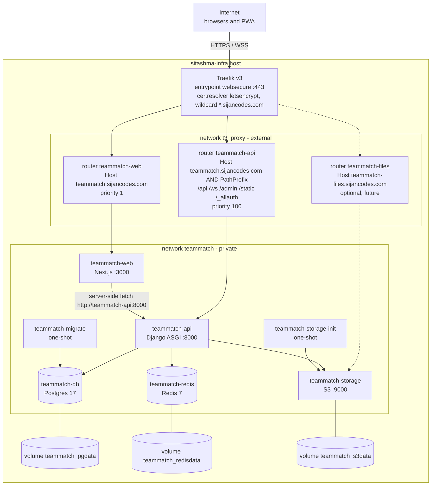

# Deployment

Prod runs on the **sitashma-infra** host behind its Traefik v3. sitashma-infra is only a temporary home: TeamMatch brings its own Postgres, Redis and SeaweedFS and shares nothing with other apps. The only touch point is the external `t3_proxy` network plus Traefik labels.

## Prod topology

Routing details:

- Both TeamMatch routers on `teammatch.sijancodes.com` match the same host. The api router has the higher `priority` so its path prefixes win; everything else falls to `web`.
- In the MVP, avatars go through the API (upload to `/api/v1/me/avatar/`, read from `/api/v1/profiles/{id}/avatar/`), so SeaweedFS is internal-only and only `teammatch.sijancodes.com` needs DNS.
- `teammatch-files.sijancodes.com` (dashed above) is optional and future, only needed if we add presigned uploads. It is one level under the wildcard, so the existing `*.sijancodes.com` cert would cover it.
- WebSockets on `/ws/` go through the same `websecure` entrypoint; Traefik handles the upgrade with no extra config.

## Networks

| Service | `t3_proxy` | `teammatch` (private) | Published ports |
|---|---|---|---|
| `teammatch-web` | yes | yes | none |
| `teammatch-api` | yes | yes | none |
| `teammatch-storage` | no in MVP (yes only with the future files host) | yes | none |
| `teammatch-db` | no | yes | none |
| `teammatch-redis` | no | yes | none |
| `teammatch-migrate` | no | yes | none |
| `teammatch-storage-init` | no | yes | none |

`t3_proxy` is `external: true` in our file. `teammatch` is created by our file.

## Self-contained stack

- Own Postgres, Redis, SeaweedFS, own named volumes (`teammatch_pgdata`, `teammatch_redisdata`, `teammatch_s3data`).
- Nothing reads or writes another app's containers, networks (other than `t3_proxy`), or volumes.
- `deploy/teammatch.prod.yml` works two ways:
  - **Standalone:** `docker compose -f deploy/teammatch.prod.yml --env-file deploy/.env up -d`
  - **Via infra:** sitashma-infra adds `apps/teammatch/deploy/teammatch.prod.yml` to its root `include:` list, services use `profiles: ["apps", "all"]` like rate-watch.
- Moving to another host = copy the compose file + `.env`, point DNS, change the Traefik labels or put another proxy in front.
- Containers run as non-root, log to stdout, `restart: unless-stopped`, required secrets use `${VAR:?}` so compose refuses to start without them.

## Local vs prod

| Aspect | Local (`compose.local.yml`) | Prod (`deploy/teammatch.prod.yml`) |
|---|---|---|
| Images | built from source, bind-mounted code | `ghcr.io/season101/teammatch-api` and `-web` at a version tag |
| api server | `uvicorn --reload` | `uvicorn` with workers, no reload |
| web server | `next dev` | `node server.js` (standalone build) |
| Entry | `localhost:3000`, Next rewrites `/api`, `/_allauth`, `/ws` to api | Traefik routers on one host |
| Ports | 3000, 8000, 9000/9001 published to localhost | none published |
| Files host | none needed (SeaweedFS console on `localhost:9001` for debugging) | none in MVP, SeaweedFS internal-only; `teammatch-files.sijancodes.com` is future |
| TLS | none | Traefik + Let's Encrypt wildcard |
| Settings | `config.settings.local`, `DEBUG=1` | `config.settings.prod`, `DEBUG=0`, secure cookies, HSTS |
| Email | console backend | SMTP |
| Secrets | `.env` from `.env.example`, dev defaults ok | `deploy/.env`, no defaults for secrets |
| Networks | one default network | `t3_proxy` (external) + `teammatch` |
| Profiles | none | `apps`, `all` |

## Environment variables

Names only; see `.env.example` and `deploy/.env.prod.example` for comments.

| Variable | Used by | Notes |
|---|---|---|
| `DJANGO_SETTINGS_MODULE` | api | `config.settings.prod` in prod |
| `DJANGO_SECRET_KEY` | api | required |
| `DJANGO_ALLOWED_HOSTS` | api | |
| `DJANGO_CSRF_TRUSTED_ORIGINS` | api | |
| `DJANGO_DEBUG` | api | |
| `PUBLIC_BASE_URL` | api, web | |
| `DATABASE_URL` | api, migrate | built from the Postgres vars |
| `POSTGRES_DB` | db | |
| `POSTGRES_USER` | db | |
| `POSTGRES_PASSWORD` | db | required |
| `REDIS_URL` | api | |
| `ALLOWED_EMAIL_DOMAINS` | api | comma separated |
| `GOOGLE_CLIENT_ID` | api | |
| `GOOGLE_CLIENT_SECRET` | api | required in prod |
| `EMAIL_URL` | api | SMTP connection |
| `DEFAULT_FROM_EMAIL` | api | |
| `AWS_S3_ENDPOINT_URL` | api | internal, `http://teammatch-storage:8333` |
| `AWS_S3_PUBLIC_ENDPOINT_URL` | api | future only, host used when signing URLs for the files host |
| `AWS_STORAGE_BUCKET_NAME` | api, storage-init | |
| `AWS_ACCESS_KEY_ID` | api, storage-init | app user, not root |
| `AWS_SECRET_ACCESS_KEY` | api, storage-init | required |
| `S3_ACCESS_KEY` | storage, api | |
| `S3_SECRET_KEY` | storage, api | required |
| `API_INTERNAL_URL` | web | `http://teammatch-api:8000` for server-side fetch |
| `NEXT_PUBLIC_WS_PATH` | web | `/ws` |
| `TEAMMATCH_VERSION` | compose | image tag to run |
| `TZ` | all | |

## Health

| Endpoint | Checks | Used by |
|---|---|---|
| `GET /healthz` | process is up, no dependencies | compose healthcheck for api |
| `GET /readyz` | db query + redis ping, returns 503 if either fails | deploy verification, manual checks |

These paths are not in the api router prefixes, so they are only reached inside the stack (compose healthcheck or `docker compose exec teammatch-api curl -fsS localhost:8000/readyz`). Public traffic to `/healthz` lands on `web`.

Other healthchecks: `pg_isready` for db, `redis-cli ping` for redis, `mc ready local` for SeaweedFS, `wget /` for web. `web` waits for `api` healthy, `api` waits for `db`, `redis`, `storage` healthy and `migrate` completed.

Deploy steps are in [cicd.md](cicd.md#manual-deploy).
