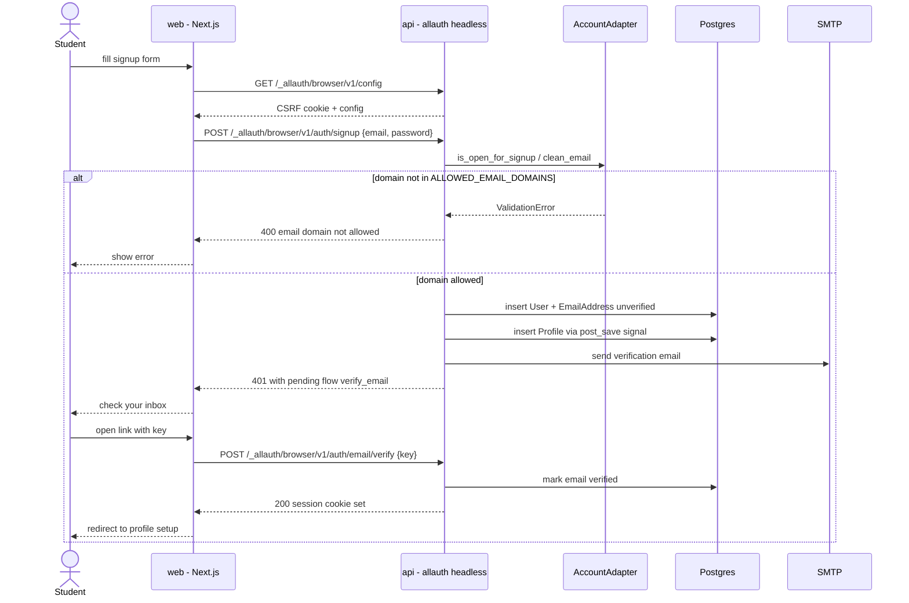
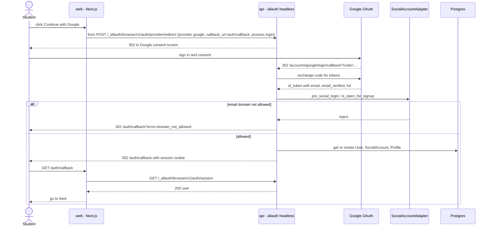
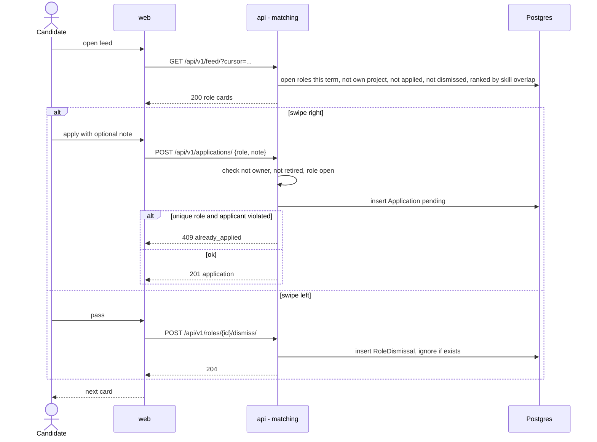
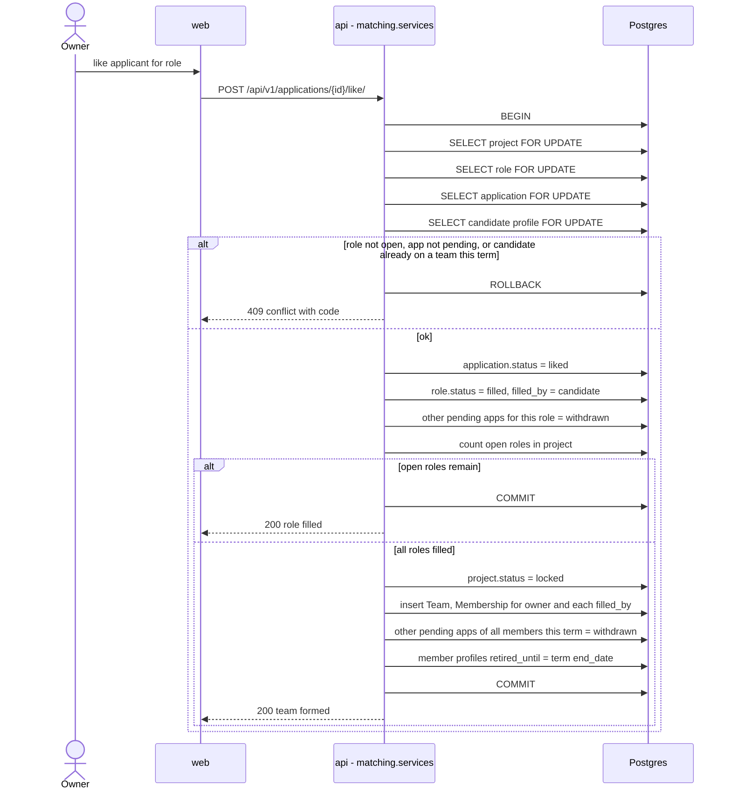
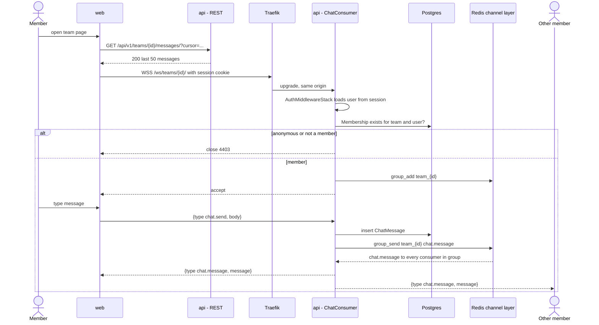
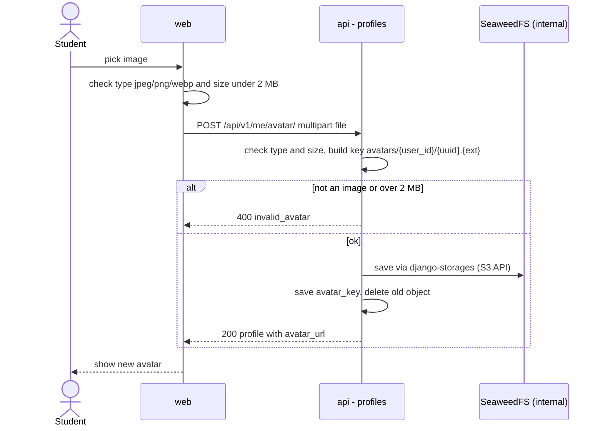

# Main Flows

Sequence diagrams for the flows that cross more than one module. Everything goes through Traefik on `teammatch.sijancodes.com`; it is left out of most diagrams to keep them readable.

## 1. Email signup with domain allowlist

## 2. Google sign-in via allauth headless

The browser does a real form POST (not fetch) so allauth can redirect to Google.

## 3. Swipe apply

## 4. Owner like, role filled, team lock

The whole like runs in one DB transaction. Row locks stop two owners of different projects from grabbing the same candidate at the same time, and stop two likes in the same project from both thinking they filled the last role.

Notes:

- Locks are always taken in the same order (project, role, application, profile) to avoid deadlocks.
- Live notifications over `/ws/notifications/` (`application.liked`, `team.formed`) are future (F3-07). In the MVP the candidate sees the new status in My applications and the team page on the next load. When notifications are added, they will be sent with `transaction.on_commit` so nobody gets an event for a rolled back change.
- The owner is a member of their own team, so owners are also blocked from other teams that term.

## 5. Team chat over WebSocket

`api - REST` and `api - ChatConsumer` are the same `api` container; uvicorn serves both HTTP and WS.

## 6. Avatar upload through the API

In the MVP the file goes through Django. SeaweedFS stays internal-only; the browser never talks to it. Presigned direct uploads through a public files host are a future optimization.

The bucket is private. `avatar_url` points at `GET /api/v1/profiles/{id}/avatar/`, which the API streams from SeaweedFS, so images are served from the same origin.
