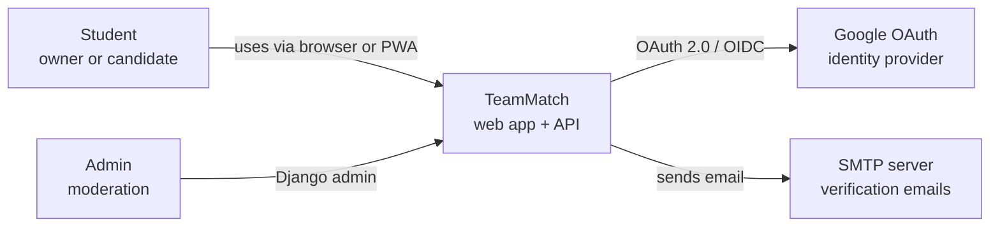
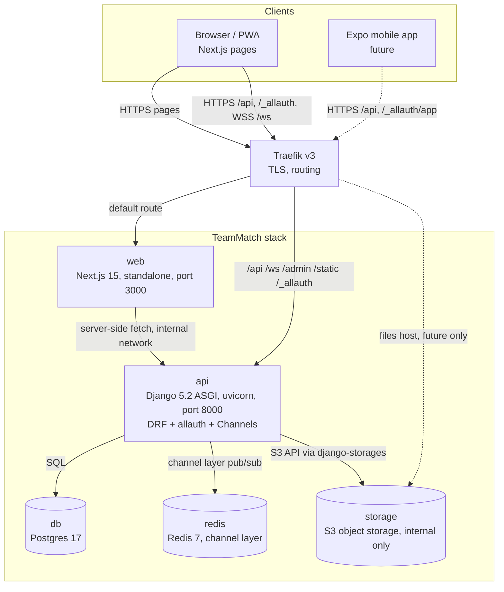

# Architecture Overview

TeamMatch is "Tinder for project teams": students swipe on open **roles** in posted projects, owners like or pass each applicant per role, and the team locks automatically once every role has a mutual like. Chat opens for locked teams and matched profiles retire until the next term.

Related docs:

- [data-model.md](data-model.md) - ERD, state machines, constraints
- [flows.md](flows.md) - sequence diagrams for the main flows
- [api.md](api.md) - REST, auth and WebSocket contract
- [deployment.md](deployment.md) - prod topology on sitashma-infra
- [cicd.md](cicd.md) - branching, CI, release and deploy
- [adr/](adr/) - architecture decision records

## Goals

1. Ship a working, deployed product every sprint (S1 to S3, final build 11/19/2026).
2. Let four people work in parallel on four epics with minimal merge pain.
3. Keep the web app (PWA) and a future Expo mobile app on the same API.
4. Keep the stack boring and self-contained so it can move hosts easily.

## Quality attributes

| Attribute     | What it means for us                                                               | How we get it                                                                           |
| ------------- | ---------------------------------------------------------------------------------- | --------------------------------------------------------------------------------------- |
| Correctness   | A team never locks with an unfilled role, a user is never on two teams in one term | DB constraints + single transaction with `select_for_update` for team lock              |
| Security      | Only allowed email domains, members-only chat, per-user authz on every endpoint    | allauth adapter allowlist, object-level DRF permissions, membership check on WS connect |
| Modifiability | Frontend and backend change independently                                          | OpenAPI contract, generated TS client, CI drift check                                   |
| Deployability | One compose file, runs anywhere with Docker                                        | Self-contained stack, own DB/Redis/SeaweedFS, images on GHCR                                |
| Usability     | Works on phone and desktop                                                         | Responsive Next.js + installable PWA                                                    |
| Observability | Easy to tell if it is up                                                           | `/healthz`, `/readyz`, stdout logs, compose healthchecks                                |

## C4 Level 1: System Context



## C4 Level 2: Containers



In the MVP, avatars go through the API: the browser uploads to `POST /api/v1/me/avatar/` and reads images from `GET /api/v1/profiles/{id}/avatar/`. SeaweedFS is only reachable inside the stack. A public `teammatch-files` host with presigned URLs is optional and future (see [deployment.md](deployment.md)).

## Module boundaries

### Backend (`backend/apps/`)

| App | Owns | Depends on |
|---|---|---|
| `core` | Base models (timestamps), `Term`, health endpoints, shared permissions, error handler, pagination | nothing |
| `accounts` | `User`, allauth adapter (domain allowlist), headless auth config | `core` |
| `profiles` | `Profile`, `Skill`, avatar upload/serve endpoints, `retire()` service and term reset command | `accounts`, `core` |
| `projects` | `Project`, `Role`, role skills, browse/search | `profiles` (skills), `core` |
| `matching` | `Application`, `RoleDismissal`, `Team`, `Membership`, feed ranking, like/pass, team lock service | `projects`, `profiles` |
| `chat` | `ChatMessage`, Channels chat consumer (notification events are future) | `matching` (team membership) |

Rules:

- Dependencies only point down the table. `projects` never imports `matching`.
- Cross-app writes go through a service function (for example `matching.services.like_application`), not by poking another app's models from a view.
- Business rules live in `services.py`, not in serializers or views.

### Frontend (`frontend/src/`)

```
app/                 Next.js App Router routes (thin, compose features)
features/
  auth/              login, signup, Google button, session hook
  profile/           profile form, skills picker, avatar upload
  projects/          project + role forms, browse/search
  feed/              swipe deck, role card, my applications
  review/            owner review queue per role
  team/              team page, chat, WS client
components/ui/       shadcn/ui primitives
lib/                 api client instance, query client, ws helper
```

Features do not import from each other; shared bits go to `components/` or `lib/`.

### Contract package (`packages/api-client/`)

- Generated from `backend/schema.yml` with `openapi-typescript` + `openapi-fetch`.
- Hand-written file only for the WS message types (mirrors [api.md](api.md#websocket)).
- Used by the web app now and the Expo app later.

## Independent pieces rules

1. The frontend talks to the backend **only** through `packages/api-client` (REST) and the documented WS message schema. It never imports backend code or hardcodes response shapes.
2. Any API change updates `backend/schema.yml` and regenerates the client in the same PR. CI fails on drift.
3. Each service (`backend`, `frontend`) has its own Dockerfile, its own dependencies file, and its own CI job. One can be built, tested and released without the other.
4. Services share nothing at runtime except the network: no shared volumes, no shared DB between apps.
5. Config comes from env vars only. No secrets in the repo.
