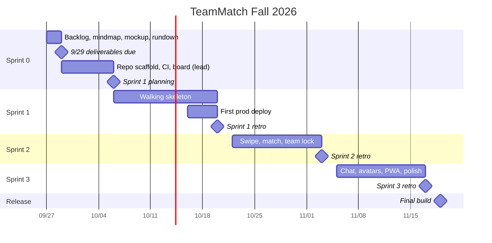

# TeamMatch - Sprint Plan

Story IDs and estimates come from [../product/backlog.md](../product/backlog.md). Member slots are in [team-roles.md](team-roles.md).

| Sprint | Dates (2026) | Goal |
|---|---|---|
| Sprint 0 | 9/27 - 10/6 | Plan, submit 9/29 deliverables; lead sets up the repo scaffold |
| Sprint 1 | 10/6 - 10/20 | Walking skeleton, deployed |
| Sprint 2 | 10/22 - 11/3 | The real product: swipe, match, team lock |
| Sprint 3 | 11/5 - 11/17 | Chat, avatars, PWA, polish |
| Final build | 11/19 | Final build and demo |

> The course **Sprint Planning spreadsheet** (our copy) is graded. Every story, task, estimate, and Hrs Left value on the GitHub Project board must be mirrored there. The board is where we work; the spreadsheet is what gets graded. Update both before each standup.

## Capacity

Each developer works exactly **10 h per sprint**, so **30 h over S1-S3**. Team of 4 = **40 h per sprint, 120 h total**.

Per member per sprint:

```
  8 h  stories in your own slot (models, endpoints, UI, tests)
+ 1 h  code reviews for teammates
+ 1 h  one rotating chore
= 10 h per sprint  x 3 sprints = 30 h per member  x 4 members = 120 h
```

| Line | Per member per sprint | Per member (S1-S3) | Team per sprint | Team total |
|---|---|---|---|---|
| Stories | 8 | 24 | 32 | 96 |
| Code review | 1 | 3 | 4 | 12 |
| Rotating chore | 1 | 3 | 4 | 12 |
| **Total** | **10** | **30** | **40** | **120** |

| Member | Sprint 1 | Sprint 2 | Sprint 3 | Total |
|---|---|---|---|---|
| A (F1) | 8 + 1 + 1 = 10 | 8 + 1 + 1 = 10 | 8 + 1 + 1 = 10 | 30 |
| B (F2) | 8 + 1 + 1 = 10 | 8 + 1 + 1 = 10 | 8 + 1 + 1 = 10 | 30 |
| C (F3) | 8 + 1 + 1 = 10 | 8 + 1 + 1 = 10 | 8 + 1 + 1 = 10 | 30 |
| D (F4) | 8 + 1 + 1 = 10 | 8 + 1 + 1 = 10 | 8 + 1 + 1 = 10 | 30 |
| **Team** | **40** | **40** | **40** | **120** |

(stories + code review + chore)

- **Sprint 0 is outside this budget.** It covers the 9/29 course deliverables and repo setup.
- **The repo scaffold is provided before S1 by the team lead** (PL-01 to PL-04): allauth auth wiring, Channels configured, CI, compose, generated API client, and empty Django apps. Feature estimates assume this plumbing already exists.
- Members still write their own models, endpoints, and UI for their stories, since implementation is graded per student on their own commits.
- Buffers (BUF-xx) are real story time for bug fixes and polish in that slot. If a buffer is not needed, pull the next Should item from your own slot.

## Timeline



## Sprint 0 (9/27 - 10/6)

**Goal:** the 9/29 deliverables are in, the lead has the scaffold ready, and everyone can run the stack locally. Outside the 30 h budget.

Due 9/29:
- `Product Backlog.md` (user + technical requirements)
- `Mindmap.mm` (Freeplane)
- Mockup screens: feed card, role card, review queue, team formed, chat
- Run-down PDF (see [../deliverables/rundown-outline.md](../deliverables/rundown-outline.md))

Rest of Sprint 0 (lead, before S1, outside the 30 h budget):
| Story | Who | Est |
|---|---|---|
| PL-01 Repo scaffold and local stack (allauth wiring, Channels, compose, empty apps) | Lead | 8 |
| PL-02 CI pipeline | Lead | 5 |
| PL-03 Project board and issue templates | Lead | 3 |
| PL-04 OpenAPI schema and generated client | Lead | 4 |

By 10/6: everyone has run `make up`, and Sprint 1 stories are split into tasks, estimated, and entered on the board and in the spreadsheet.

## Sprint 1 (10/6 - 10/20) - walking skeleton, deployed

**Goal:** a user can sign up and build a profile with skills, post a project with roles, another user can see roles in a feed and apply, and the owner can see applicants and like or pass. The team model and lock rule are tested. Running on the prod URL.

| Member | Stories (8 h) | Review | Chore (pick one) | Total |
|---|---|---|---|---|
| A (F1) | F1-01 Email sign up (2), F1-02 Sign in/out (2), F1-03 Profile (2), F1-04 Skills (2) | 1 | 1 | 10 |
| B (F2) | F2-01 Create project (3), F2-02 Roles with skills + publish (3), F2-03 List projects (2) | 1 | 1 | 10 |
| C (F3) | F3-08 Role card (2), F3-01 Role feed (3), F3-02 Apply with note (3) | 1 | 1 | 10 |
| D (F4) | F4-01 Applicants per role (3), F4-02 Like/pass (2), F4-03 Team model + lock rule (3) | 1 | 1 | 10 |

S1 chores (one each): PL-05 First production deploy, PL-10 Seed data script, PL-11 Burn chart + sprint report, PL-12 Wiki/docs page for the sprint's features.

## Sprint 2 (10/22 - 11/3) - the real product

**Goal:** swiping works, likes fill roles, teams lock on their own with auto-withdraw and retire, and Google sign-in with the domain allowlist is live.

| Member | Stories (8 h) | Review | Chore (pick one) | Total |
|---|---|---|---|---|
| A (F1) | F1-05 Google sign-in (3), F1-06 Domain allowlist (2), F1-08 Retired users blocked + term reset command (3) | 1 | 1 | 10 |
| B (F2) | F2-04 Project detail (2), F2-05 Edit/close project (3), F2-06 Delete unfillable role (2), buffer (1) | 1 | 1 | 10 |
| C (F3) | F3-03 Swipe deck (4), F3-05 Pass (1), F3-06 My applications + withdraw (3) | 1 | 1 | 10 |
| D (F4) | F4-04 Review queue UI (3), F4-05 Mutual like fills role + team lock (3), F4-07 Auto-withdraw + call retire (2) | 1 | 1 | 10 |

S2 chores (one each): PL-06 Cut release tag + deploy, PL-11 Burn chart + sprint report, PL-13 API docs refresh, PL-14 Playwright setup + smoke test.

## Sprint 3 (11/5 - 11/17) - chat and polish

**Goal:** locked teams chat in real time, avatars upload, the app installs as a PWA, the feed ranks by skill fit with undo, and the golden path has an e2e test.

| Member | Stories (8 h) | Review | Chore (pick one) | Total |
|---|---|---|---|---|
| A (F1) | F1-07 Avatar upload through the API (4), PL-07 Admin moderation (2), polish/bug buffer (2) | 1 | 1 | 10 |
| B (F2) | F2-08 Installable PWA (3), F2-07 Search + skill filter (3), F2-10 Responsive pass (2) | 1 | 1 | 10 |
| C (F3) | F3-04 Skill-overlap ranking (3), F3-09 Button/keyboard controls (1), F3-10 Undo last swipe (2), buffer (2) | 1 | 1 | 10 |
| D (F4) | F4-08 Team chat over WebSocket (6), F4-09 Chat history + reconnect (2) | 1 | 1 | 10 |

S3 chores (one each): PL-06 Final release + deploy, PL-11 Burn chart + sprint report, PL-08 Golden-path e2e test (extends PL-14), PL-09 Final README + docs.

Bug fixes from the demo run and final build prep on 11/18-11/19 come out of the S3 buffers.

Moved to the future backlog to fit 30 h per person: F1-09 Account settings, F3-07 Live notifications, F2-09 Full accessibility audit, presigned avatar uploads.

## Definition of Ready

A story can be pulled into a sprint when:
- It is written as "As a... I want... so that..." with Given/When/Then acceptance criteria.
- It has an epic, an owner slot, a sprint, and an hour estimate (split if over 8 h).
- Any API change it needs is sketched (endpoint, request, response) so frontend and backend can work in parallel.
- Dependencies on other stories are listed and either done or planned earlier in the same sprint.
- It is on the board and in the spreadsheet.

## Definition of Done

A story is done when:
- All acceptance criteria pass.
- Code is merged to `main` through a PR with one approving review and a named reviewer.
- CI is green (lint, types, tests, build, contract check, secret scan).
- Tests are added: backend tests for rules and permissions, frontend tests for key components.
- UI is keyboard-usable, inputs are labeled, and colors meet AA contrast.
- `schema.yml` and the generated client are up to date if the API changed.
- It works on the deployed site (from Sprint 1 on) or locally with `make up` if not deployed yet.
- Board status is Done, Hrs Left is 0, and the spreadsheet matches.

## Ceremonies

| Ceremony | When | What |
|---|---|---|
| Sprint planning | First class of each sprint (10/6, 10/22, 11/5) | Pick stories, split into tasks, estimate, assign, enter in board and spreadsheet |
| Standup | Every class meeting | Each member: done since last time, doing next, blockers. **Update Hrs Left on your tasks before standup.** |
| Backlog refinement | Mid-sprint, about 20 minutes | Write and estimate stories for the next sprint, check Definition of Ready |
| Sprint review | End of each sprint | Demo working features from the deployed site |
| Retrospective | On the course retro dates (end of each sprint: 10/20, 11/3, 11/17) | What went well, what didn't, one or two changes to try. Tag the release (`vS.x.0`) after retro. |

## Tracking

- **Board:** GitHub Project with Status (Backlog, Ready, In progress, In review, Done), Sprint, Epic, Estimate, Hrs Left, Owner.
- **Spreadsheet:** course Sprint Planning copy, same stories and hours. Graded.
- **Burn-down:** from the Hrs Left column, per sprint.
- **Branches:** `feat/<issue#>-slug`, `fix/...`, `chore/...`, `docs/...`. PR body has `Closes #n` and a `Reviewer:` line.
