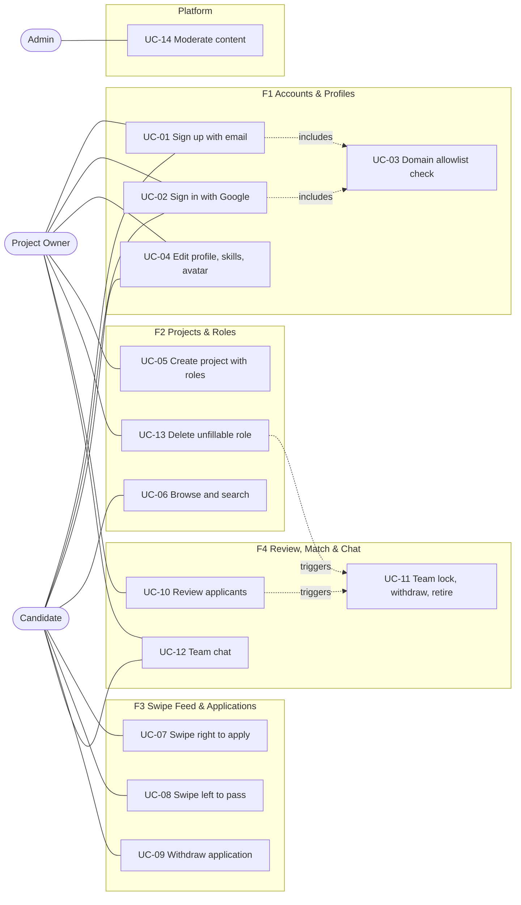
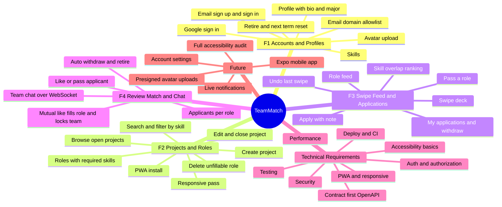

# TeamMatch - Product Requirements

CSC 5323 Advanced Software Engineering, Louisiana Tech, Fall 2026.

Related docs: [use-cases.md](use-cases.md), [backlog.md](backlog.md), [../planning/sprint-plan.md](../planning/sprint-plan.md).

## 1. Problem

Forming project teams in a class is slow and awkward. People with ideas post in a group chat, a few friends join, and the roles the project actually needs (a backend dev, a designer, someone who can do data) go unfilled. Students with skills but no idea have no good way to find a project that needs them. Teams end up formed by who sits near whom, not by what the project needs.

## 2. Narrative

**TeamMatch is Tinder for project teams - you swipe on roles, not people.**

A project owner posts an idea and the roles it needs. Candidates get a deck of role cards ranked by how well their skills fit. Swipe right to apply, left to pass. The owner reviews applicants role by role and likes or passes. When a role has a mutual like, it is filled. When every role is filled, the team forms.

## 3. The twist

- The match unit is the **team**, not a pair. A project only locks when **every** role has a mutual like.
- Matching is **role by role**. You apply to "Backend Developer on Project X", not to Project X.
- Once a team locks, its members **retire** until the end of the term: their other pending applications are withdrawn and they drop out of other decks. No double-booking.
- Team chat only unlocks when the team is locked.

## 4. Personas

| Persona | Who | Wants | Pain today |
|---|---|---|---|
| Project Owner | Student with a project idea | Fill specific roles with people who have the right skills | Only hears from friends; can't tell who has what skills |
| Candidate | Student with skills, no idea yet (or a better fit elsewhere) | Find a project where their skills matter | Doesn't know which projects need them |
| Admin | Course staff or the dev team | Keep the platform clean; manage terms and skills | No visibility into who posted what |
| Instructor (future) | Professor running a course | See team formation status for a section | Tracks teams in a spreadsheet |

A user can be both an owner and a candidate in the same term, but not on their own project.

## 5. Goals and non-goals

### Goals
- A student can go from sign-up to a formed team in one session when the other side is responsive.
- Owners fill roles with people who have the listed skills.
- No one ends up on two teams in the same term.
- Works on phone and desktop as an installable PWA.
- Each team member ships working code in their own epic every sprint.

### Non-goals (for this course)
- Native mobile or desktop apps (future backlog; the API is built so a mobile client can reuse it).
- Grading, attendance, or LMS integration.
- Payments, ads, or anything outside of team formation.
- Public profiles visible to people outside the allowed email domains.
- Video/voice chat, file sharing in chat.
- Deferred to the future backlog to fit our capacity (10 h per member per sprint): live notifications (F3-07), account settings such as password change and account delete (F1-09), a full accessibility audit (F2-09), and presigned avatar uploads through a public files host.

## 6. MVP scope

| Epic | Feature | Summary | Owner slot |
|---|---|---|---|
| F1 | Accounts & Profiles | Email/password and Google sign-in, email domain allowlist, profile with bio, major, skills, avatar (uploaded through the API), retire and term reset | Member A |
| F2 | Projects & Roles | Create/edit/close a project, define roles with required skills, delete an unfillable role, browse and search, installable PWA, responsive pass | Member B |
| F3 | Swipe Feed & Applications | Role card deck ranked by skill overlap, swipe to apply or pass, undo last swipe, my applications, withdraw | Member C |
| F4 | Review, Match & Team Chat | Review queue per role, like/pass applicants, fill role on mutual like, auto team-lock, auto-withdraw and retire, real-time team chat | Member D |
| Platform | Platform & DevOps | Repo scaffold, CI, contract (OpenAPI) by the lead before S1; deploys, releases, seed data, e2e test, docs as rotating 1 h chores; admin moderation (Member A) | Lead / rotating |

Capacity: 4 members x 10 h per sprint x 3 sprints = 120 h. Each member does 8 h of stories + 1 h code review + 1 h rotating chore per sprint.

Full stories and acceptance criteria are in [backlog.md](backlog.md).

## 7. Business rules

These are enforced in the backend and each one has a test.

| ID | Rule |
|---|---|
| BR-01 | Only emails from `ALLOWED_EMAIL_DOMAINS` can sign up or sign in, for both email/password and Google. |
| BR-02 | One application per (user, role). Re-applying to the same role is rejected. |
| BR-03 | A user can apply to many roles across many projects at the same time. |
| BR-04 | An owner cannot apply to roles on their own project. |
| BR-05 | A role is filled when the owner likes an applicant who has a pending application for it (mutual like). A filled role stores `filled_by`. |
| BR-06 | A project locks only when **all** of its roles are filled. A project with zero roles cannot be opened. |
| BR-07 | The owner can delete an open role that cannot be filled. Deleting the last unfilled role triggers the lock check. |
| BR-08 | When a team locks, every member's other pending applications for that term are set to `withdrawn`, and their profile gets `retired_until = term.end`. |
| BR-09 | Retired users do not appear to owners as applicants and cannot apply until their retirement ends. |
| BR-10 | A candidate "pass" hides that role from their deck (`RoleDismissal`); it does not notify the owner. |
| BR-11 | A candidate can withdraw a pending application. Liked (filled) applications cannot be withdrawn by the candidate. |
| BR-12 | A chat room exists only for a locked team. Only team members (owner + filled roles) can read or post. |
| BR-13 | Locked projects are read-only except for archiving by the owner or admin. |

## 8. Data model (summary)

`User` 1:1 `Profile` (bio, major, avatar_key, retired_until) M:N `Skill`. `Term` (name, start, end). `Project` (owner, term, title, pitch, status draft/open/locked/archived) 1:N `Role` (title, description, required_skills, status open/filled, filled_by). `Application` (role, applicant, status pending/liked/passed/withdrawn, note, unique role+applicant). `RoleDismissal` (user, role). `Team` (project 1:1, formed_at) 1:N `Membership`. `ChatMessage` (team, sender, body, created_at).

The full ERD is in [../architecture/data-model.md](../architecture/data-model.md).

## 9. Use-case diagram

## 10. Requirements map

Mirrors [../deliverables/Mindmap.mm](../deliverables/Mindmap.mm).

## 11. Success metrics

| Metric | Target at final build (11/19) |
|---|---|
| Golden path (sign up, create project, apply, like, team locks, chat) works end to end on the deployed site | Yes, covered by a Playwright test |
| Time for a new user to sign up and apply to a role | Under 3 minutes |
| Double-booking (user on two locked teams in one term) | 0, enforced by tests |
| Feed and review API response time at seed scale (200 users, 50 projects) | p95 under 300 ms |
| Chat message delivery between two members | Under 1 second |
| Lighthouse PWA installable; accessibility basics (keyboard-usable, labeled inputs, AA contrast) | Installable; basics met on every screen |
| Each member merges work in their epic every sprint | 4 of 4 members, 3 of 3 sprints |
| Stories planned vs done per sprint | 80% or better |

## 12. Assumptions

- Everyone using the app has an email in an allowed domain (for class use, `latech.edu`).
- One active term at a time; an admin creates terms in Django admin.
- Skills are a shared list managed by admin, with users able to pick from it (no free-text skills in MVP).
- The app is hosted on the team's server behind Traefik with HTTPS; Google OAuth credentials are available.
- Class sizes are small (hundreds of users), so no heavy scaling work is needed.

## 13. Risks

| Risk | Impact | Mitigation |
|---|---|---|
| Team-lock logic has race conditions (two likes at once) | Wrong team state | Do the lock check in one DB transaction with row locks; test concurrent likes |
| WebSocket chat is harder to deploy than HTTP | Chat slips from S3 | Channels is configured in the scaffold before S1 and checked by the first prod deploy |
| Google OAuth setup blocked by redirect/domain config | F1-05 slips | Email/password ships first in S1; Google is S2 |
| Uneven workload between epics | Some members idle, grading is per student | Every member has exactly 8 h of stories + 2 h team tax per sprint; chores rotate; buffers absorb slips |
| Frontend and backend drift | Broken builds late in sprint | Contract-first OpenAPI, generated client, CI drift check |
| Nobody ever has a full team, so the lock never triggers in demo | Weak demo | Seed data with a term, skills, and ready-to-lock projects |
| Hosting server down near demo | Demo fails | Local compose runs the full stack; keep a recorded walkthrough |
